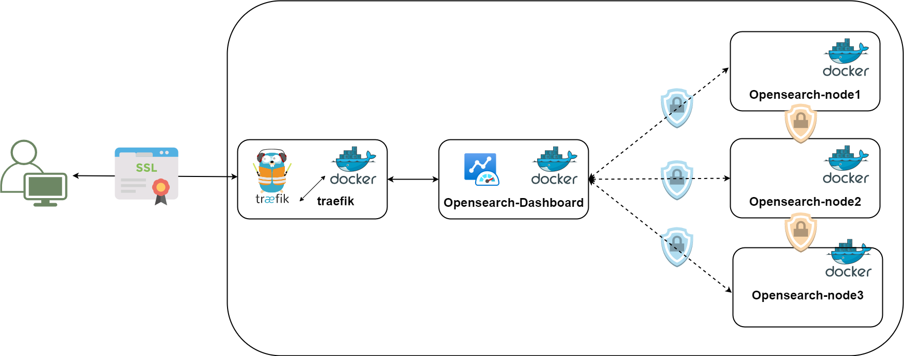

# OpenSearch Project


Dockerized cluster architecture for OpenSearch with compose.

## Description

This project deploys an OpenSearch cluster with 3 master nodes, 1 OpenSearch Dashboard node, and 1 Logstash node. The cluster uses SSL to secure communication between nodes, and the SSL certificates are generated as part of the deployment process. Also, traefik has been used for security between the user and the opensearch dashboard.




## Key concepts

- OpenSearch = Elasticsearch
- OpenSearch Dashboards = Kibana

## Requirements

- Docker
- Docker Compose
- OpenSSL

## Pre-Deploy Step

Raise your host's ulimits for ElasticSearch to handle high I/O :

```
sudo sysctl -w vm.max_map_count=512000
```

To Persist this setting: 

Add the following line to `/etc/sysctl.conf`:

```
vm.max_map_count=512000
```

Reload the config as root:

```
sysctl -p
```

Check the new value:

```
cat /proc/sys/vm/max_map_count
```

## Deployment Steps

1. Clone the repository
```
git clone https://github.com/mrmoghadasi/ELK.git
```
2. Navigate to the project directory:
```
cd opensearch-project
```

3. Generate the certificates for the cluster:

```bash
./generate-certs.sh
```

4. Fixing permissions with:
```
chown -R 1000:1000 certs
```

5. Define Domain:

To enable SSL communication between the user's browser and opensearch dashboard, you need to connect a domain to your server's IP address.
After connecting the desired domain to the server IP, to set it up in file `docker-compose.yml` section `labels`, enter the new domain instead of `elk.webimoon.ir`.

```
"traefik.http.routers.opensearch-dashboard.rule=Host(`elk.webimoon.ir`)"
```

6. Start the cluster using Docker Compose:
```
docker-compose up -d
```

7. Initialize the security plugin (after up all container):

```
./init-security.sh
```


The cluster should now be up and running, with the OpenSearch Dashboard accessible at `https://<dashboard-node-ip>:5601`.


## Configuration


### Change Password

To create a password for each user, enter the following command: 
```bash
docker-compose exec os-n1 bash -c "plugins/opensearch-security/tools/hash.sh -p new_password"
```
This command creates a hashed password. Instead of `new_password`, enter the new password.

Users and passwords are configured in `internal_users.yml` file.

After adding or editing passwords in `internal_users.yml` , run this commands to apply the new passwords.

```
docker-compose restart
./init-security.sh
```

## Usage
Access OpenSearch Dashboards via `http://{{your_server_ip}}:5601`

Default username is `admin` and password is `mrm_pass`.


Test the connection:

```bash
curl -XGET --insecure https://localhost:9200 -u admin:mrm_pass
```

## Troubleshooting

- If any of the nodes fail to start, check the logs using `docker logs -f <container-name>`.
- If SSL certificate errors occur, regenerate the certificates by running the `./generate-certs.sh
` script again.

## License

[MIT](https://choosealicense.com/licenses/mit/) 
This project is licensed under the MIT License.

## Credits

This project was created by My User (mrm.elec@email.com)

[](https://www.linkedin.com/in/mohamad-reza-moghadasi-5755b959/) [](mailto:mrm.elec@gmail.com)
